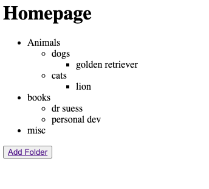

# Hierarchical Data

## What This Website Is About

A Django-based server that uses the Modified Preorder Tree Traversal (MPTT) technique to store hierarchical data.

## Usage Instructions

Use the 'Add Folder' button to create a root folder
Then add another folder to create subfolder for that root folder
https://127.0.0.1 takes you to admin panel to also create folders (SEE CREDENTIAL BELOW)

## Credentials

SUPERUSER
u: admin
p: admin123

## Contributors

Kevin Blount
